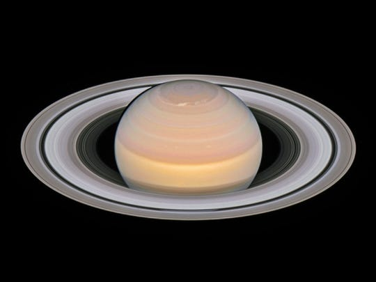

## Far out: Saturn will be 'Nearby' on Tuesday, So you Might See its Rings

Saturn, its rings and its moons will be paying a "close" visit to Earth Tuesday night. 

Saturn is at "opposition" that day, meaning the planet and the sun are on _opposite_ sides of the Earth, according to NASA. **That also means the ringed planet is as close to the Earth as it gets all year long!**

It will be visible with the naked eye all night long, rising in the East around sunset and slowly making its way across the sky before setting in the West around sunrise, according to [AccuWeather](https://www.accuweather.com/).

> “If you have never spotted Saturn's rings, now is your chance,” - AccuWeather astronomy blogger Dave Samuhel

Some of Saturn's moons might also be visible with a telescope, NASA said. If you see its moons, Titan will be the brightest. 

## Story Highlights

* Saturn will be visible with the naked eye all night long
* You'll need a telescope to see the planet's famous rings
* The planet will be in good view throughout July, August and September

